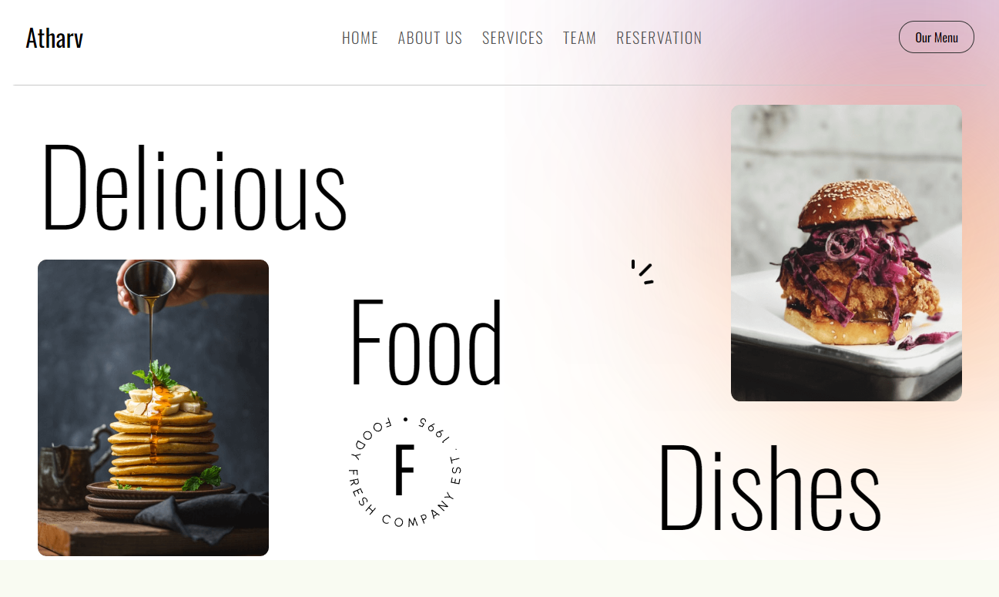

              
<h1 align="center" style="font-weight: bold;">Restaurant Application</h1>

<p align="center">
<a href="#tech">Technologies</a>
<a href="#started">Getting Started</a>
<a href="#routes">API Endpoints</a>
<a href="#colab">Collaborators</a>
<a href="#contribute">Contribute</a> 
</p>


<p align="center">A Dynamic Restaurant application made with MERN Stack that let's you take reservations for your Restaurant</p>


<p align="center">
<a href="https://restaurant-application-with-mern.vercel.app/">📱 Visit this Project</a>
</p>
 
<h2 id="technologies">💻 Technologies</h2>

- React
- MongoDB Atlas
- Express
- Node.js

<h2 id="layout">🎨 Layout</h2>

<p>

</p>
 
<h2 id="started">🚀 Getting started</h2>

### install dependencies
```bash
npm install
```
### start the dev server
```bash
npm run dev
```
 
<h3>Starting</h3>

How to start your project

```bash
cd Restaurant-Application-with-MERN
//For Frontend
cd Frontend
npm run dev

//For Backend
cd Backend
npm run dev
```
 
<h3>Prerequisites</h3>

- [NodeJS](https://github.com/)
- [Git](https://github.com)
 
<h3>Cloning</h3>

How to clone your project

```bash
git clone https://github.com/atharvdange618/Restaurant-Application-with-MERN.git
```
 
<h2 id="contribute">📫 Contribute</h2>

Your contributions and suggestions are welcome! Here's how you can contribute to this repository:

1. `git clone https://github.com/atharvdange618/Restaurant-Application-with-MERN.git`
2. `git checkout -b feature/NAME`
3. Follow commit patterns
4. Open a Pull Request explaining the problem solved or feature made, if exists, append screenshot of visual modifications and wait for the review!
 
<h3>Documentations that might help</h3>

[📝 How to create a Pull Request](https://www.atlassian.com/br/git/tutorials/making-a-pull-request)

[💾 Commit pattern](https://gist.github.com/joshbuchea/6f47e86d2510bce28f8e7f42ae84c716)
